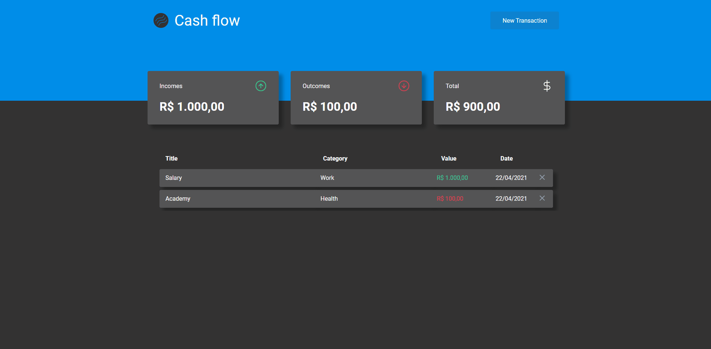

<h1 align="center">CASH FLOW</h1>

<h4 align="center">
  Application to control your balance including incomes and outcomes
</h4>

<a href="https://cashflow-boff.vercel.app/">
  Live Demo
</a>

---

<p align="center">
  

  

  

  
</p>

<h2>📔 Description</h2>

This is a simple application to control the cash flow including your incomes and outcomes. Using firebase as database it's not necessary a backend to save data.

---

`Application`

<details>
  <summary>See</summary>



</details>

<h2>🚀 Technologies</h2>

- [Typescript](https://www.typescriptlang.org/)
- [ReactJS](https://reactjs.org/)
- [Axios](https://github.com/axios/axios)
- [Styled-Components](https://styled-components.com/)
- [ESLint](https://eslint.org/)
- [Prettier](https://prettier.io/)
- [Firebase](https://firebase.google.com/)
- [Vercel](https://vercel.com/)

---

<h2>❓ How to use</h2>

```bash
# Clone this repository
$ git clone https://github.com/MarceloHBoff/cashflow

# Go into the repository
$ cd cashflow

# Install dependencies for the frontend
$ yarn or npm install

# Run the frontend
$ yarn start or npm run start
```

Made with love by [Marcelo Boff!](https://www.linkedin.com/in/marcelo-boff)
